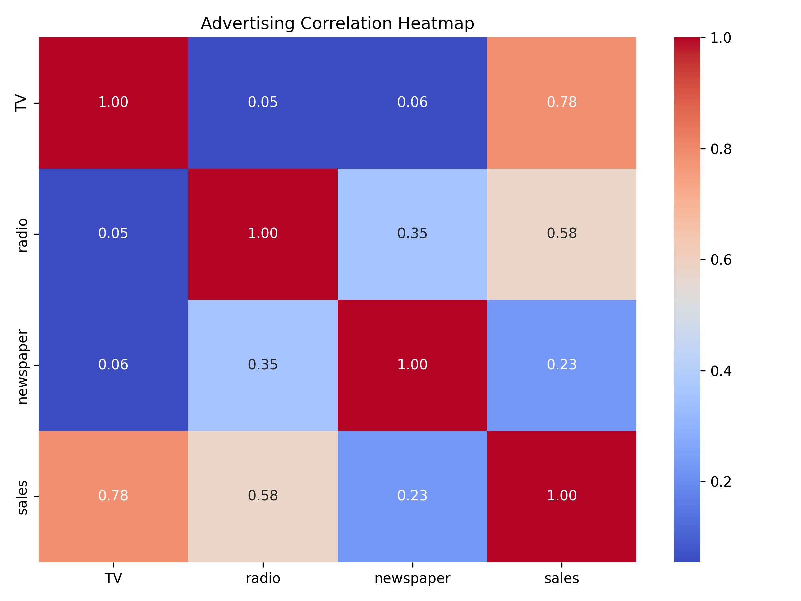
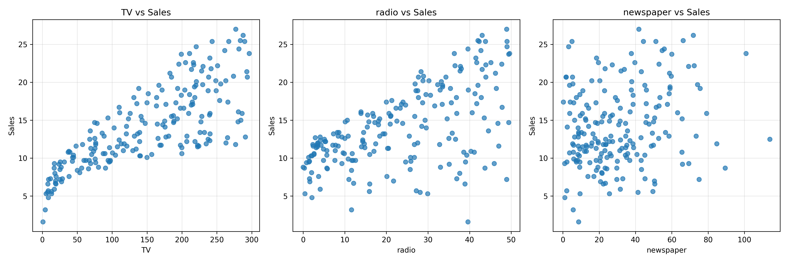
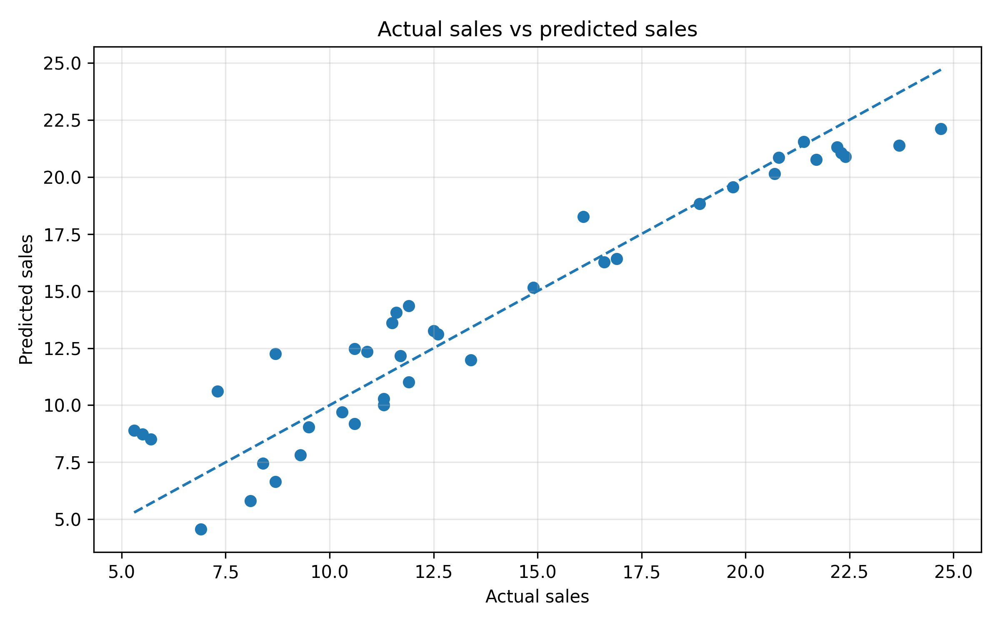
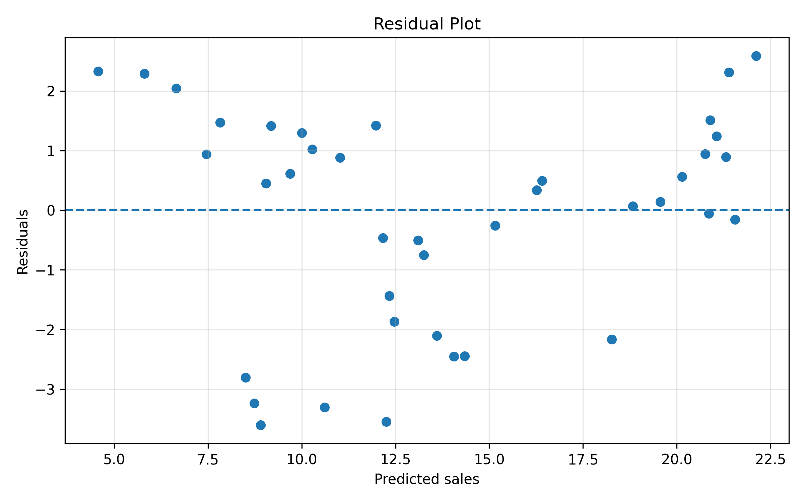

# Advertising Sales Prediction using Linear Regression

## Project Overview

This project implements a Machine Learning model to predict product sales based on advertising expenditure across three marketing channels: **TV, Radio, and Newspaper**.

A Linear Regression algorithm is implemented using Scikit-learn. The project includes data exploration, preprocessing, model training, prediction, evaluation, and visualization to understand the relationship between advertising expenditure and sales.

## Objectives

- Analyze the Advertising dataset.
- Explore statistical summaries and correlations.
- Check and handle missing values.
- Split the dataset into training and testing sets.
- Build a Machine Learning pipeline.
- Train a Linear Regression model.
- Predict sales using advertising expenditure.
- Evaluate model performance using regression metrics.
- Visualize correlations, actual vs. predicted sales, and residuals.

## Technologies Used

- **Python** — Programming language
- **Pandas** — Data manipulation and analysis
- **NumPy** — Numerical computations
- **Matplotlib** — Data visualization
- **Seaborn** — Correlation heatmap
- **Scikit-learn** — Machine Learning, preprocessing, pipeline, and evaluation

## Project Structure

```text
Advertising/
├── AdvertisingSales_Linear_Regression.py
├── Advertising.csv
├── README.md
├── requirements.txt
├── correlation_heatmap.png
├── advertising_channels_vs_sales.png
├── actual_vs_predicted.png
└── residual_plot.png
```

*Note: The visualization files are saved directly in the project directory.*

## Dataset Description

The project uses `Advertising.csv`, containing advertising expenditure and corresponding sales data.

| Feature | Description |
|---|---|
| TV | Advertising expenditure on TV |
| radio | Advertising expenditure on radio |
| newspaper | Advertising expenditure on newspapers |
| sales | Sales value — target variable |

The independent variables are `TV`, `radio`, and `newspaper`. The dependent variable is `sales`.

## Machine Learning Workflow

### Step 1: Load Dataset
Loads the Advertising dataset using Pandas.

### Step 2: Remove Unwanted Columns
Checks for and removes the `Unnamed: 0` column if present.

### Step 3: Check Missing Values
Displays the missing-value count for each column.

### Step 4: Statistical Summary
Uses `describe()` to examine the dataset's statistical properties.

### Step 5: Correlation Analysis
Displays the correlation matrix and generates a heatmap to examine relationships between variables.

### Step 6: Split Independent and Dependent Variables
- **Features (X):** TV, radio, newspaper
- **Target (Y):** sales

### Step 7: Train-Test Split
Splits the dataset into:
- 80% training data
- 20% testing data

Uses `random_state=42` for reproducibility.

### Step 8: Create ML Pipeline
Creates a Scikit-learn pipeline containing:
1. `SimpleImputer` — replaces missing feature values using the median.
2. `StandardScaler` — standardizes feature values.
3. `LinearRegression` — predicts sales.

### Step 9: Train the Model
Fits the pipeline using the training dataset.

### Step 10: Test the Model
Predicts sales for the test dataset.

### Step 11: Evaluate Model Performance
Calculates:
- **Mean Squared Error (MSE):** Measures the average squared prediction error.
- **Root Mean Squared Error (RMSE):** Measures prediction error in the target's units.
- **R² Score:** Measures how well the model explains variation in sales.

### Step 12: Calculate Model Coefficients
Displays the learned coefficients for TV, radio, and newspaper, along with the intercept.

### Step 13: Compare Actual and Predicted Values
Creates a DataFrame to compare actual sales against predicted sales.

### Step 14: Actual vs. Predicted Visualization
Plots actual sales against predicted sales and includes an ideal-prediction reference line.

### Step 15: Residual Analysis
Plots residuals against predicted sales to help examine prediction errors and potential patterns.

## Visualizations

### 1. Correlation Heatmap



Shows the correlation between advertising channels and sales.

### 2. Advertising Channels vs. Sales



Displays the relationship between TV, radio, newspaper advertising, and sales.

### 3. Actual vs. Predicted Sales



Compares the model's predictions with actual sales values.

### 4. Residual Plot



Helps identify patterns in prediction errors and assess whether the model may be missing important relationships.

## Installation and Execution

### Prerequisites
- Python 3 installed
- VS Code installed
- Advertising project files available locally

### 1. Open the Project
Open the `Advertising` folder in VS Code.

### 2. Install Dependencies

Open the VS Code terminal and run:

```bash
pip install -r requirements.txt
```

### 3. Run the Project

```bash
python AdvertisingSales_Linear_Regression.py
```

Ensure that `Advertising.csv` is present in the same directory as the Python file.


## Model Evaluation

The model's performance is evaluated using MSE, RMSE, and R² score.

The actual metric values depend on the dataset and model execution. Run the program to obtain the results; no fixed accuracy or performance score is assumed in this README.

## Future Improvements

The project can be extended in the following ways:

1. **Cross-Validation:** Use cross-validation to evaluate model stability across multiple data splits.
2. **Feature Engineering:** Explore additional features and useful transformations.
3. **Model Comparison:** Compare Linear Regression with Ridge, Lasso, Decision Tree, and Random Forest regression.
4. **Hyperparameter Tuning:** Optimize parameters for suitable alternative models.
5. **Advanced Evaluation:** Add MAE and adjusted R² where appropriate.
6. **Improved Visualizations:** Add prediction-error distributions and feature relationship plots.
7. **Automated Testing:** Add tests for dataset loading, preprocessing, and predictions.
8. **Model Persistence:** Save and reload the trained pipeline using Joblib.
9. **Prediction Interface:** Build a simple Streamlit application for interactive sales predictions.
10. **Reproducible Workflow:** Add configuration options and improve dataset-path handling.

These are potential future enhancements; they are not all implemented in the current version.

## Conclusion

This project demonstrates an end-to-end introductory Machine Learning workflow using Linear Regression. It combines data exploration, preprocessing, pipeline-based training, prediction, evaluation, and visualization to study how advertising expenditure relates to sales.
